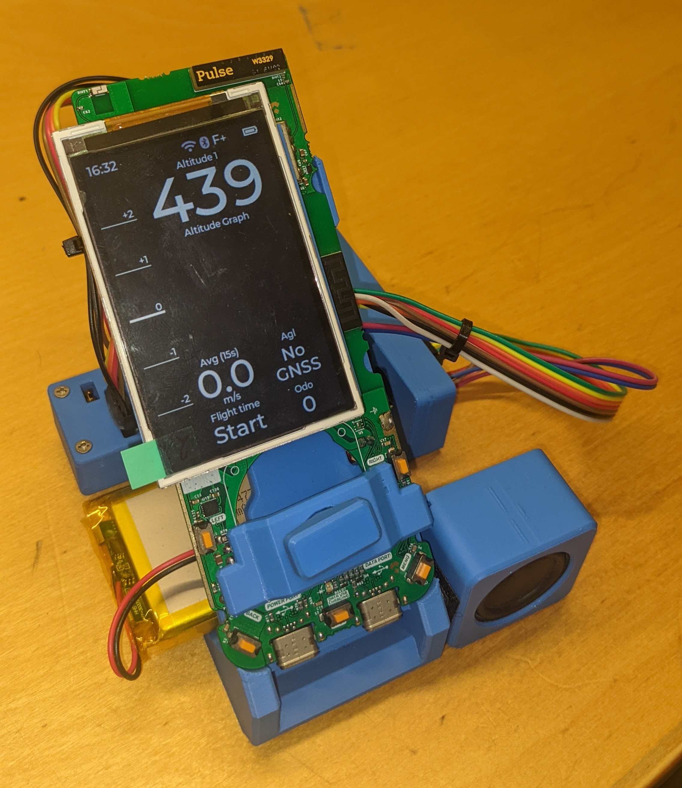
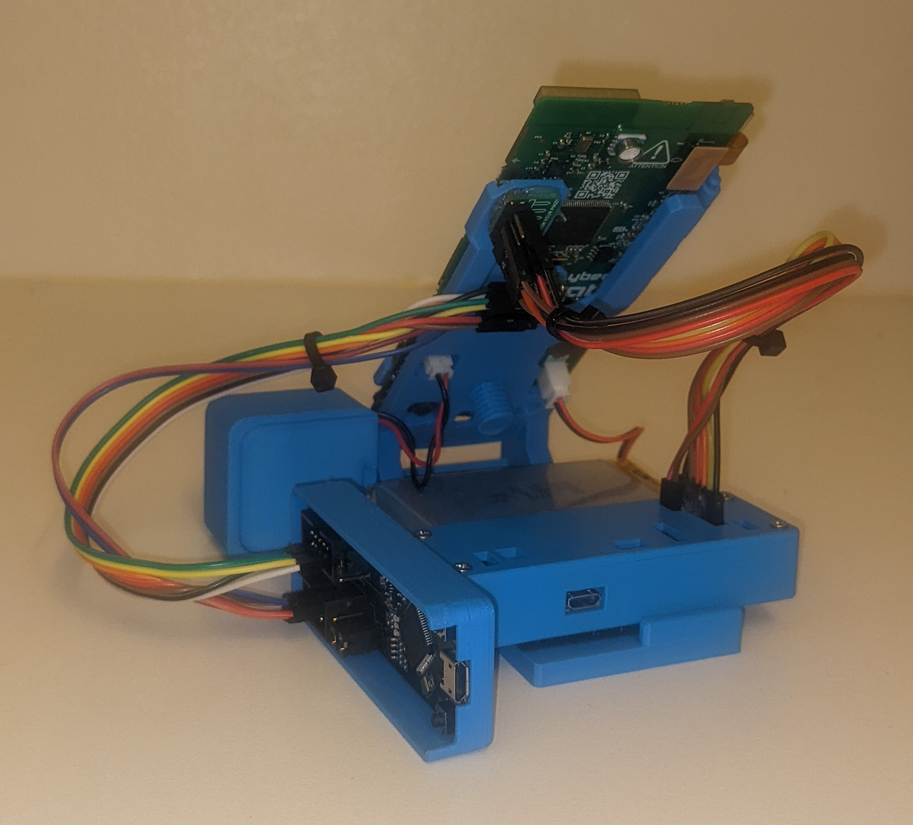

# Hardware

Here you find a description of various aspects of the hardware of
Strato.

## Memory

There are different types of memory on this device with different
characteristics.

### RAM

This is ~1024 kB of RAM which can be used by `malloc()` and
`free()`. This memory is also used for global variables and for stack
and its local variables.

187.5kB this memory is used for the frame buffer. The memory can be
used in a standard way by using pointers.

### Direct coupled RAM

This memory is 128 kB and is very fast.

Describe, how to access and use this RAM....

### PSRAM

This memory has a size of 8 MB but is quiete slow (~10 MBit/s),
compared to the above memories. It is used to store data, which is not
used very often, e.g. map data or AGL data.

Use `ps_malloc()` and `ps_free()` for this memory. The memory can be
used in a standard way by using pointers.

# Development Board

There is also a development board available which is a standard strato
with additional connections.

At the bottom you find the standard USB connectors like any other
strato, as well as the buttons as small orange rectangles.

On the back side you find a USB connector called "st-link". If
connected to a Linux computer, it shows up as /dev/ttyACM0. You can
use `Utilities/gps_spoof/igc_playback.py` to send the GPS data from a
IGC file to simulate the corresponding flight.

